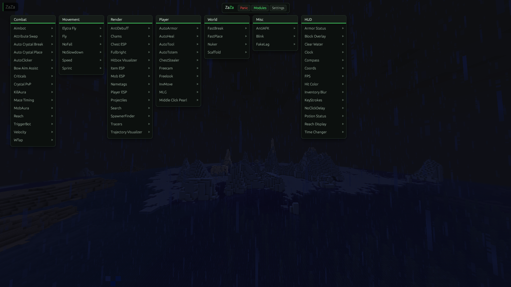
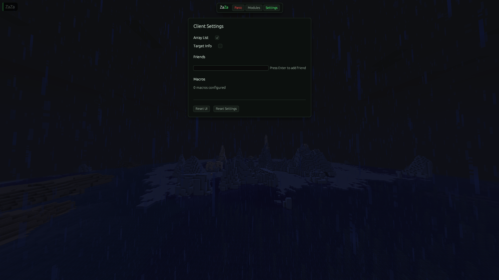
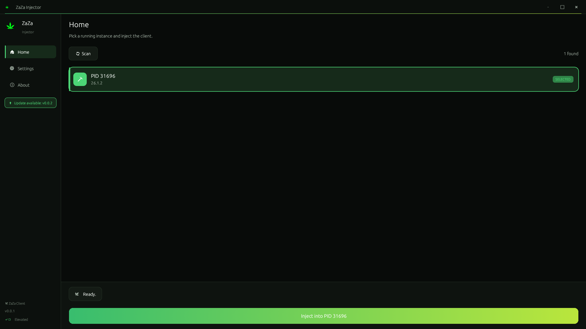

# 🌿 ZaZa

  
  
  

<h3 align="center">
A modern, high-performance Windows and others application written in Rust.
</h3>

---

# 📖 About

**ZaZa** is a Rust-based Windows project focused on performance, responsiveness, and a clean user experience. The application is designed with efficiency in mind while maintaining a polished and intuitive interface.

---

# 🖼️ Showcase

## Main Window

---

## Settings

---

## Injector

---

# ✨ Highlights

*  Native Rust performance
*  Lightweight design
*  Modern Windows interface
*  Easy configuration
*  Organized project structure
*  Fast startup
*  Continuous improvements

---

# 🚀 Getting Started

## Requirements

* Windows 10 or newer (you can maybe use it on mac and linux idk never teset)
* Latest release of ZaZa

## Installation

1. Download the latest release.
2. Extract the archive.
3. Disable Anti Virus (only maybe, idk windows is weird)
4. Launch the executable.

---

# 📈 Development

The project is written entirely in **Rust** and is continuously being refined with an emphasis on performance and maintainability.

---

# 🛣️ Roadmap

* [ ] Make it 100% undetectable
* [ ] more Quality of life Modules
* [ ] and more shit ye

---

# ❓ Frequently Asked Questions

### Is ZaZa actively maintained?

Yes. The project receives ongoing updates and improvements.

---

### Will more features be added?

Future updates are planned as development progresses.

---

### Where can I report issues?

Use the GitHub Issues page or our discord server (https://discord.gg/NhnDDNgzZF).

---

# 📜 License

## All Rights Reserved © 2026 ZaZa Developers

This repository and all of its contents are proprietary.

No individual or organization is permitted to:

* Copy this project.
* Modify the source code.
* Redistribute any files.
* Re-upload this repository.
* Create derivative works.
* Sell or sublicense any portion of this project.

Viewing this repository does **not** grant permission to use its contents.

Unauthorized use is strictly prohibited.

---

# ⭐ Support

If you appreciate the project, consider starring the repository to support future development.

---

### 🌿 ZaZa

**Rust • Performance**

Made with ❤️ by ZaZa Developers.
-# credits to TheDarkSword for the whole template

